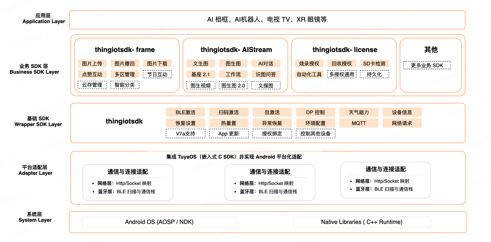
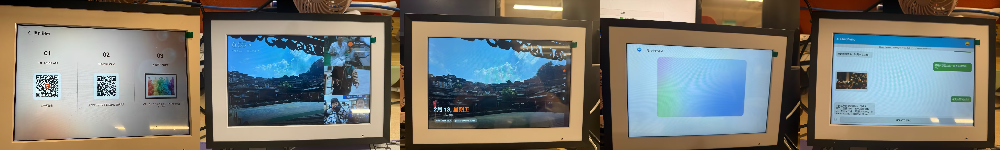
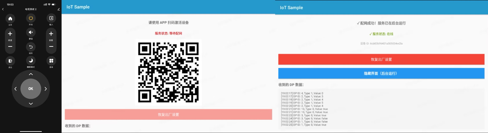

# TuyaOS Android Platform


---

**English** | [📖 中文文档](./README_zh.md)


## 🎯 Project Introduction

TuyaOS is a distributed cross-platform operating system designed for IoT applications, built on kernels such as RTOS, Linux, and Non-OS, targeting full connectivity and all scenarios. [More about TuyaOS](https://github.com/tuya/tuyaos-iot-wifi-ble-bk7231n)

**TuyaOS Android Platform** is the Android platform implementation of TuyaOS. It enables developers to rapidly develop AI products on Android systems, including basic OS features such as device pairing, control, device management, and AI capabilities. Developers can quickly implement TuyaOS devices and AI products on Android systems.

This project contains multiple samples based on TuyaOS implementations on the Android platform.

---

## 📐 Architecture Overview



---

## 📦 Repository Structure

```
TuyaOS_android_platform/
├── README.md                        # English documentation (this file)
├── README_zh.md                     # Chinese documentation
├── doc/                             # Detailed development documentation
│   ├── SDK使用文档 1-基础IoT文档.md    # Base IoT documentation
│   ├── SDK使用文档 2-AI使用文档.MD     # AI capabilities documentation
│   ├── SDK使用文档 3-相框文档.md       # Smart photo frame documentation
│   ├── SDK使用文档 4-产测文档.md       # Production testing documentation
│   ├── 产测系统使用指南.md             # Production testing operation guide
│   └── img/                         # Documentation images
├── sample-ai-frame/                 # Sample: AI Smart Photo Frame
├── sample-iot-tv/                   # Sample: IoT TV Control
├── sample-iot-ipc/                  # Sample: IoT IPC Camera Streaming
├── build.gradle                     # Top-level build configuration
├── settings.gradle                  # Module configuration
└── gradle/                          # Gradle wrapper
```


---

## 📖 Documentation

| Document | Description |
|----------|-------------|
| [Base IoT Guide](./doc/SDK使用文档%201-基础IoT文档.md) | SDK initialization, pairing, DP points, device control, API calls |
| [AI Guide](./doc/SDK使用文档%202-AI使用文档.MD) | AI Stream connection, session management, multimodal data transmission, audio recording/playback |
| [Photo Frame Guide](./doc/SDK使用文档%203-相框文档.md) | Photo frame initialization, photo management, event listening |
| [Production Testing Guide](./doc/SDK使用文档%204-产测文档.md) | Production testing module integration, license management |
| [Production Testing Operation Manual](./doc/产测系统使用指南.md) | Operation manual for production testing personnel |

---

## 📚 Sample Projects

### 🖼️ AI Smart Photo Frame (`sample-ai-frame`)

A complete AI-powered smart photo frame sample demonstrating the combined use of multiple TuyaOS capabilities:

| Feature | Description | Status |
|---------|-------------|--------|
| Device Pairing | BLE / QR Code pairing and activation | ✅ Ready |
| DP Communication | Data Point reporting and command dispatch | ✅ Ready |
| AI Chat | Multimodal AI conversation — voice / text / image input | ✅ Ready |
| Text-to-Image / Image-to-Image | AI-generated images | ✅ Ready |
| Photo Frame Management | Cloud photo upload, download, and display | ✅ Ready |
| License Provisioning | SD card license burning | ✅ Ready |




### 📺 IoT TV Control (`sample-iot-tv`)

A smart TV remote control sample built on TuyaOS:

| Feature | Description | Status |
|---------|-------------|--------|
| Volume Control | Precise volume level control (0-100) | ✅ Fully Supported |
| Mute Control | Mute / unmute toggle | ✅ Fully Supported |
| Home Button | Return to TV home screen | ✅ Fully Supported |
| D-pad Navigation | Up / Down / Left / Right (requires system permission) | ⚠️ System Permission |
| Menu / OK / Back | Remote key simulation (requires system permission) | ⚠️ System Permission |




### 📹 IoT IPC Camera Streaming (`sample-iot-ipc`)

A minimal IPC (IP camera) sample built on TuyaOS — the smallest skeleton needed to push a live A/V stream as a camera device. Flow: SDK init → show QR code → wait for app pairing → init P2P/IPC after MQTT goes online → start camera and push H.264 / G.711U stream when the app pulls video.

| Feature | Description | Status |
|---------|-------------|--------|
| Device Pairing | QR Code pairing and activation | ✅ Ready |
| P2P / IPC Channel | Init live-video channel after MQTT online | ✅ Ready |
| Video Streaming | Camera2 → MediaCodec H.264, pushed via P2P | ✅ Ready |
| Audio Streaming | Mic PCM16 → G.711 µ-law | ✅ Ready |
| Adaptive Bitrate | Encoder bitrate adjusts to network load level | ✅ Ready |

---

## 🔗 Resources

- **[Tuya Developer Platform](https://developer.tuya.com)** — Official developer hub
- **[Community Forum](https://www.tuyaos.com/viewforum.php?f=2)** — Developer community
- **[TuyaOS Introduction](https://github.com/tuya/tuyaos-iot-wifi-ble-bk7231n)** — TuyaOS BK Platform

---

**Happy coding! 🎉**
