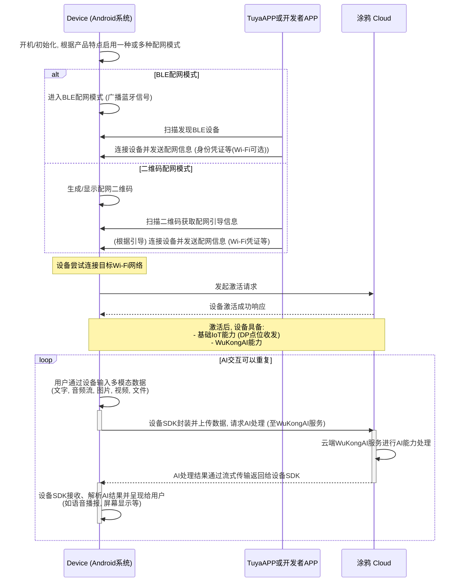

# Android 平台 TuyaOS使用文档

TuyaOS 原生运行于 Android 平台，可以低成本使用 TuyaOS 能力，包括配网、控制、设备管理 等基础 OS 功能及 AI 能力。基于此，开发者可依托 Android 系统快速实现 TuyaOS 设备及 AI 产品的开发。

### 整体流程
以下描述了设备从配网激活到使用 AI 能力的完整流程。

**开发者的工作范围：**

-   基于 `thingiotsdk` SDK 开发设备逻辑
-   可使用涂鸦提供的 APP，或基于 App SDK 开发自有 APP



### 功能清单

**TuyaOS 基础能力**

| 功能类   | 功能点                       | 是否支持 |
| -------- | ---------------------------- | -------- |
| 设备入网 | 设备重置（解绑）             | ✅        |
| 设备入网 | 设备恢复出厂设置             | ✅        |
| 设备入网 | 设备 BLE 模式入网            | ✅        |
| 设备入网 | 设备二维码入网               | ✅        |
| 控制     | DP 点数据下发与上报          | ✅        |
| 控制     | 局域网下 DP 点数据下发与上报 | ✅        |
| 设备信息 | 获取设备详细信息             | ✅        |
| 设备信息 | 获取天气信息                 | ✅        |
| 信号强度 | 信号强度查询                 | ✅        |

**AI能力**

| AI 使用场景 | 功能点 |   |
| ------- | ---------- | ---------- |
| AI对话 | 设定AI 的角色、适用群体等，聊天内容适配特定群体。支持表情反馈、与聊天情绪|  |
| 文生图   | 根据描述进行生图  |   |
| 图生图   | 提供原图，根据描述进行生图 |   |
| 技能绑定   | 查询天气等 |   |


# 设备侧接入说明

## 1、集成sdk

见集成文档中集成 com.thingclips.smart:thingiotsdk  [集成指南](./SDK集成指南.md)


# 2、设备初始化准备

### 1、SDK 初始化

```
    ThingOS.getInstance().init(this);
```


### 2、设备初始化

设备初始化，当设备初始化后，可以识别设备当前处于配网状态或者已配网状态以及准备好所有的通信链路。初始化完成后才可以进行后续的操作。

```java

//step1: 获取IIoTManager对象,对象为单例的。 统一在ThingOS.getInstance()中维护
IIoTManager ioTSDKManager = ThingOS.getInstance().getIoTSDKManager();


/**
 * step 2: 初始化SDK 准备参数
 *
 * @param productId 产品id
 * @param uuid      用户id
 * @param authKey   认证key
 * @param mCallback SDK回调方法
 * @return
 */
IoTParams params = new IoTParams.Builder()
        .addMode(IoTParams.Mode.MODE_QR) //配网模式，QR为二维码模式
//        .addMode(IoTParams.Mode.MODE_BLE) //若想同样支持蓝牙配网，可以添加MODE_BLE
        .productId("rqhj4jlgxpleba7i") //产品ID，设备对应的产品ID
        .uuid("tuya5d2b1057105573d5") //授权码中的uuid，一个设备一组授权码
        .authKey("yC8gNh9dGzoYJPEEwOMTiqZ8nEnqMRnP") //授权码中的authKey，一个设备一组授权码
        .version("1.0.0") //设备 software 版本号,用于app 上设备的版本信息
        .enableHotReset(true) //是否启用热重置，默认为true。启用后设备重置无需重启应用
        .ioTCallback(mIotCallback)
        .build();


//step 3: 初始化sdk
int result = ioTSDKManager.initSDK(params);

if (result == OpenCode.CODE_OK) {
    TLog.i(TAG, "initSDK success");
    // 初始化成功
    // 注意：初始化成功不代表MQTT已连接，MQTT状态通过 IoTCallback.onMQTTStatusChanged() 回调通知
} else {
    TLog.e(TAG, "initSDK failed: " + result);
    // 初始化失败，错误码含义：
    // OpenCode.ERR_PATH (-10001): 存储路径创建失败
    // OpenCode.ERR_DEVICE + rt: 设备初始化失败
}

```

**参数说明：**

| 参数 | 类型 | 必填 | 说明 |
|------|------|------|------|
| productId | String | 是 | 产品ID，设备对应的产品ID |
| uuid | String | 是 | 授权码中的uuid，一个设备一组授权码 |
| authKey | String | 是 | 授权码中的authKey，一个设备一组授权码 |
| version | String | 是 | 设备 software 版本号，格式：xx.xx.xx |
| enableHotReset | boolean | 否 | 是否启用热重置，默认true。启用后设备重置后无需重启即可重新绑定。 |
| ioTCallback | IoTCallback | 是 | SDK回调接口 |

**初始化流程说明：**

1. `initSDK()` 为同步方法，返回 `OpenCode.CODE_OK` (0) 表示初始化成功
2. 初始化成功后，SDK 会自动进行网络连接和 MQTT 连接
3. MQTT 连接状态通过 `IoTCallback.onMQTTStatusChanged()` 回调通知
4. 设备激活状态通过 `IoTCallback.onActive()` 或 `onFirstActive()` 回调通知


### 初始化回调

```java

public interface IoTCallback {

    /**
     * dp事件接收
     *
     * @param event 事件类型
     *              DPEvent.Type.PROP_BOOL
     *              DPEvent.Type.PROP_VALUE
     *              DPEvent.Type.PROP_STR
     *              DPEvent.Type.PROP_ENUM
     *              DPEvent.Type.PROP_BITMAP
     *              DPEvent.Type.PROP_RAW
     */
    void onDpEvent(DPEvent event);

    /**
     * 设备重置回调
     * <p>
     * 当设备被重置时触发，包括云端解绑、本地重置、恢复出厂设置等操作
     *
     * @param resetType 重置类型，参见 {@link ResetType}
     *                  <ul>
     *                  <li>ResetType.GW_LOCAL_RESET_FACTORY - 本地重置出厂设置（该类型不支持热重置）</li>
     *                  <li>ResetType.REMOTE_UNACTIVE - 远程解绑 (APP删除)</li>
     *                  <li>ResetType.LOCAL_UNACTIVE - 本地解绑 (本地删除)</li>
     *                  <li>ResetType.REMOTE_RESET_FACTORY - 远程重置出厂设置 (APP删除并清除数据)</li>
     *                  </ul>
     */
    void onReset(ResetType resetType);

    //收到配网二维码短链，可用于扫码配网
    void onShorturl(String url);

    //设备激活（已配网设备启动时回调）
    void onActive();

    //设备初次激活（首次配网成功时回调）
    void onFirstActive();

    /**
     * MQTT状态变化
     *
     * @param status IoTSDKManager.STATUS_OFFLINE (0) 设备离线;
     *               IoTSDKManager.STATUS_MQTT_OFFLINE (1) 设备在线MQTT离线;
     *               IoTSDKManager.STATUS_MQTT_ONLINE (2) 设备在线MQTT在线
     */
    void onMQTTStatusChanged(int status);

    /**
     * mqtt消息回调
     *
     * @param protocol 协议号
     * @param msg      消息内容（JSON字符串）
     */
    void onMqttMsg(int protocol, String msg);

}
```

**回调方法说明：**

| 回调方法 | 触发时机 | 说明 |
|---------|---------|------|
| onDpEvent | 收到DP指令时 | 处理云端下发的DP点控制指令 |
| onReset | 设备被重置时 | 云端解绑或本地重置触发，参数包含重置类型（ResetType） |
| onShorturl | 生成配网二维码时 | 用于展示配网二维码 |
| onActive | 已配网设备启动时 | 设备已绑定，正常启动 |
| onFirstActive | 首次配网成功时 | 设备完成首次绑定激活 |
| onMQTTStatusChanged | MQTT连接状态变化时 | 监控设备与云端的连接状态 |
| onMqttMsg | 收到MQTT消息时 | 需先调用registerMqttMessageOut注册协议号 |


# 3、设备操作

### 重置设备

#### 解绑设备

重置设备后需要重新初始化，会进行应用杀死重启。

```java
public boolean reset()
```

**说明：**
- 解绑设备，清除设备绑定关系
- 重置后需要重新配网激活
- 返回 `true` 表示成功，`false` 表示失败

**示例：**
```java
boolean success = ioTSDKManager.reset();
if (success) {
    TLog.d(TAG, "设备解绑成功");
} else {
    TLog.e(TAG, "设备解绑失败");
}
```

#### 恢复出厂设置

恢复设备到出厂设置状态，清除所有数据。⚠️注意注意！！ 设备主动调用回复出厂设置，设备无法热重置。

```java
public boolean resetFactory()
```

**说明：**
- 恢复设备到出厂设置状态
- 清除所有本地数据和配置
- 重置后需要重新配网激活
- 返回 `true` 表示成功，`false` 表示失败

**示例：**
```java
boolean success = ioTSDKManager.resetFactory();
if (success) {
    TLog.d(TAG, "恢复出厂设置成功");
} else {
    TLog.e(TAG, "恢复出厂设置失败");
}
```

#### 重置类型说明

在 `onReset()` 回调中，可以通过 `ResetType` 枚举区分不同的重置类型：

```java
public enum ResetType {
    GW_LOCAL_RESET_FACTORY(0, "本地重置出厂设置"),
    REMOTE_UNACTIVE(1, "远程解绑"),
    LOCAL_UNACTIVE(2, "本地解绑"),
    REMOTE_RESET_FACTORY(3, "远程重置出厂设置"),
    UNKNOWN(-1, "未知类型");
}
```

****

```java

```

### 下发DP指令

dp为数据操作点 dataPoint的缩写，表示的含义为功能点，先经由产品功能配置dp，配置完成后就可以使用对应dp完成信息传输，实现控制，信息同步等功能。

```java
    int sendDP(int id, int type, Object val)

    /**
     * 发送dp事件带时间戳
     *
     * @param id        dp id
     * @param type      类型 DPEvent.Type
     * @param val       值
     * @param timestamp 时间戳 单位秒
     * @return
     */
    int sendDPWithTimeStamp(int id, int type, Object val, int timestamp)

    /**
     * 发送多个dp事件
     *
     * @param events 多个dp类型
     * @return
     */
   int sendDP(DPEvent... events)

    /**
     * 发送多个dp事件
     *
     * @param events 多个dp类型
     * @return
     */
    int sendDPWithTimeStamp(DPEvent... events) 
```

### 获取设备信息

#### 获取设备虚拟ID

```java
String deviceId = ioTSDKManager.getDeviceId();
//设备激活后 可以拿到devId，未激活拿不到
```

#### 获取设备绑定状态

```java
int state = ioTSDKManager.getDeviceState();
返回值：
// state = OpenCode.CODE_DEVICE_UNACTIVE ; // Device is unactive
// state = OpenCode.CODE_DEVICE_ACTIVED ; // Device is actived
// state = OpenCode.CODE_DEVICE_UNINIT; // Device is uninit
```

#### 获取设备详细信息（部分字段）

通过设备 API 获取设备的详细信息，可以指定需要返回的字段。

```java
// 获取设备 API 实例
IDeviceApi deviceApi = ioTSDKManager.getDeviceApi();

// 指定需要获取的字段
ArrayList<String> fields = new ArrayList<>();
fields.add("productId");
fields.add("name");
fields.add("icon");

// 调用 API
deviceApi.fetchDeviceInfo(fields, new ApiCallback<String>() {
    @Override
    public void onSuccess(String result) {
        // result 为 JSON 字符串，包含设备信息
        TLog.d(TAG, "设备信息: " + result);
    }

    @Override
    public void onFailure(String errorCode, String errorMessage) {
        TLog.e(TAG, "获取设备信息失败: " + errorMessage);
    }
});
```

**说明：**
- `expectedFields` 为 `null` 或空列表时，返回所有字段
- 返回结果为 JSON 字符串格式
- API: `tuya.device.info.fetch`

#### 获取天气信息

##### 方式一：自定义天气代码

可以自定义需要获取的天气数据代码。

```java
IDeviceApi deviceApi = ioTSDKManager.getDeviceApi();

ArrayList<String> codes = new ArrayList<>();
codes.add("w.temp");          // 温度
codes.add("w.humidity");      // 湿度
codes.add("w.windLevel");     // 风力等级
codes.add("w.pm25");          // PM2.5
codes.add("w.conditionNum");  // 天气状况编号
codes.add("w.date");          // 日期
codes.add("w.currdate");      // 当前日期

deviceApi.getWeather(codes, new ApiCallback<String>() {
    @Override
    public void onSuccess(String result) {
        // result 为 JSON 字符串，格式如：
        // {"w.temp.0":17,"w.humidity.0":68,"w.conditionNum.0":"120",...}
        TLog.d(TAG, "天气信息: " + result);
    }

    @Override
    public void onFailure(String errorCode, String errorMessage) {
        TLog.e(TAG, "获取天气信息失败: " + errorMessage);
    }
});
```

##### 方式二：使用默认参数（推荐）

使用内置的天气代码列表，返回解析后的 `WeatherInfo` 对象。

```java
IDeviceApi deviceApi = ioTSDKManager.getDeviceApi();

deviceApi.getWeatherDefault(new ApiCallback<WeatherInfo>() {
    @Override
    public void onSuccess(WeatherInfo weatherInfo) {
        // 获取今天的温度
        Integer temp = weatherInfo.getTemp(0);
        // 获取今天的湿度
        Integer humidity = weatherInfo.getHumidity(0);
        // 获取今天的天气状况
        String condition = weatherInfo.getConditionNum(0);
        
        TLog.d(TAG, "今天温度: " + temp + "°C, 湿度: " + humidity + "%");
    }

    @Override
    public void onFailure(String errorCode, String errorMessage) {
        TLog.e(TAG, "获取天气信息失败: " + errorMessage);
    }
});
```

**WeatherInfo 对象方法：**
- `getTemp(int index)` - 获取温度（index: 0=今天, 1=明天, 2=后天）
- `getHumidity(int index)` - 获取湿度
- `getConditionNum(int index)` - 获取天气状况编号
- `getWindLevel(int index)` - 获取风力等级
- `getPm25(int index)` - 获取PM2.5值
- `getDate(int index)` - 获取日期
- `getCurrdate()` - 获取当前日期
- `getRawData()` - 获取原始数据 Map

**说明：**
- API: `thing.weather.get`
- 默认参数包含：w.temp, w.humidity, w.windLevel, w.pm25, w.conditionNum, w.date, w.currdate
- 推荐使用 `getWeatherDefault()` 方法，返回类型化的对象，使用更方便


### 设备 API

通过 `getDeviceApi()` 可以获取设备相关的 API 接口，用于调用设备相关的云端接口。

```java
// 获取设备 API 实例
IDeviceApi deviceApi = ioTSDKManager.getDeviceApi();
```

**可用的 API 方法：**
- `fetchDeviceInfo()` - 获取设备信息
- `getWeather()` - 获取天气信息（自定义参数）
- `getWeatherDefault()` - 获取天气信息（默认参数）

详细使用方法请参考上面的"获取设备信息"和"获取天气信息"章节。

---

### HTTP 请求

如果需要请求其他网络接口，可以使用以下操作：

```java
    
//传入api 以及api版本 ，并设置api所需要参数
ApiParams apiParams = new ApiParams("tuya.device.xxx.xxx", "1.0");
apiParams.put("lang", "zh-CN");
apiParams.put("xxx", xxx);


// 调用  ThingApiHelper.request 进行请求
ThingApiHelper.request(apiParams, String.class, new ApiCallback<String>() {
        @Override
        public void onSuccess(String result) {
            TLog.w(TAG, "http request success: " + result);
        }

        @Override
        public void onFailure(String errorCode, String errorMessage) {
            TLog.e(TAG, "http request failed: " + errorCode + ", " + errorMessage);
        }
    });
```

---

## 📋 更新日志

### 2025-12-15

#### 新增功能
- ✅ **恢复出厂设置 API** - 新增 `resetFactory()` 方法，支持恢复设备到出厂设置状态
- ✅ **设备 API 接口** - 新增 `getDeviceApi()` 方法，提供设备相关的云端接口
  - `fetchDeviceInfo()` - 获取设备详细信息（支持指定字段）
  - `getWeather()` - 获取天气信息（自定义参数）
  - `getWeatherDefault()` - 获取天气信息（默认参数，返回类型化对象）
- ✅ **重置类型枚举** - 新增 `ResetType` 枚举，用于区分不同的重置类型

#### API 变更
- 🔄 **onReset 回调增强** - `onReset()` 方法现在会传递 `ResetType` 参数，可以区分不同的重置类型
  - 旧版本：`void onReset()`
  - 新版本：`void onReset(ResetType resetType)`

#### 数据模型
- ✅ **WeatherInfo** - 新增天气信息数据模型，提供类型化的天气数据访问


