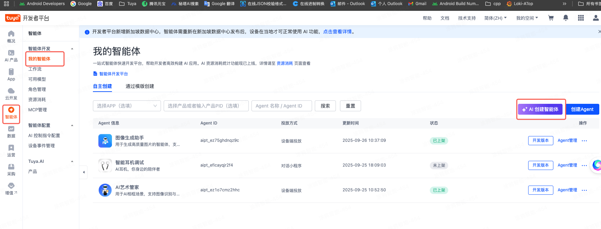
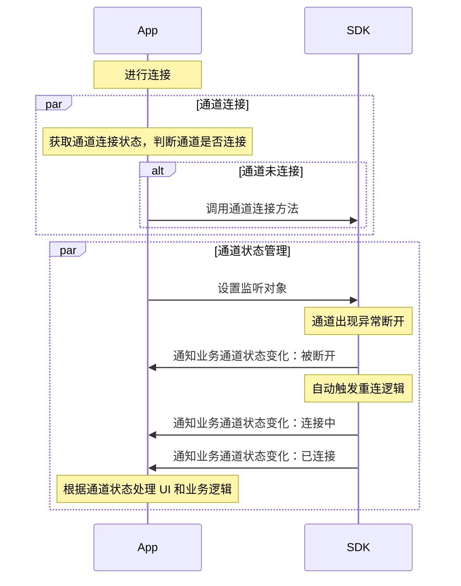
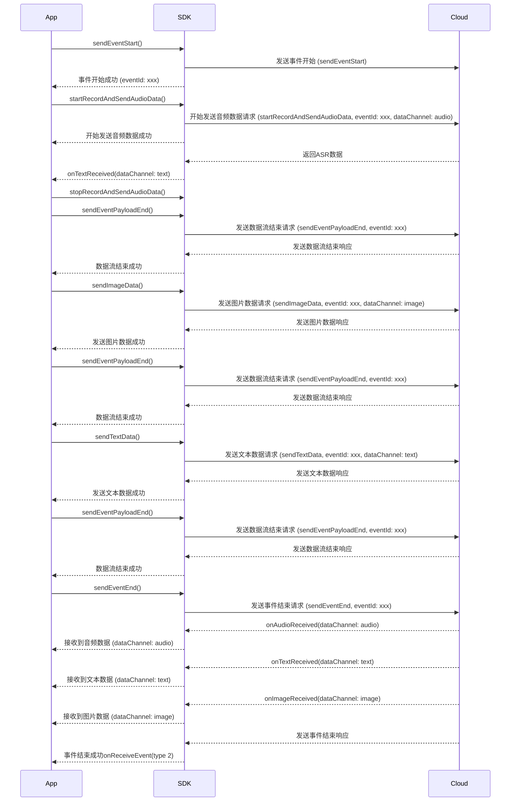

## 前置准备


### 智能体准备

为了确保智能体在您的 设备（Android 系统）中可用，需要完成以下流程：
1. 创建智能体
2. 发布智能体
3. 投放智能体到指定设备

**智能体能干什么？**

智能体是可以满足某些场景所要求的处理方式的 AI解决方案。可以配置音色、语速、语调、回答要求、能力处理要求等。
比如需要一个可以对话翻译的功能，智能体的创建的时候 就设定这些要求。进行多模态输入后，多模态NLG 输出的就是翻译。
如果需要一个对话聊天的AI智能体，智能体在创建的时候，就设定可以对话，并且设置一些其他的，比如回答长短，注重什么方面这些。


## 通道流程

### 通道 (Connection) 管理

进行 AI 使用前，需要进行连接，连接会建立 一个长连接的通道。



### 会话 (Session) 管理

会话是建立在通道之上，一个通道内可以有多个会话 Session，数据流传输需要 Session。【注意，为了优化接入方的体验，即将合并成单 Session 通道 】

当使用不同智能体、不同配置时，需要使用这些信息请求获取 Agent Token 并创建会话。

```mermaid

```

### 数据流传输

在数据流传递之前，请先确保已经完成了 会话 Session 创建。

这里先介绍几个概念：

**事件(Event)**

`Event` 可以是 App 往服务端发送，也可以是服务端投递给 App。

**发送时**，主要包含 `EventStart`、`EventEnd`、`ChatBreak` 事件：

- EventStart：标记事件开始，在传递数据流之前，需要先发送该事件。需要传递一个 EventId，直到发送 EventEnd / ChatBreak 之前，都需要使用相同的 EventId。
- EventEnd：标记事件结束，在所有数据流传递完成后，发送该事件，服务端接受到该事件后会将所有数据投递给智能体进行处理
- ChatBreak：打断事件，既可以在发送数据流时打断，也可以再接受数据流时打断

**接收时**，主要包含  `EventStart、`EventEnd`、`ChatBreak` 、`ServerVAD` 事件：

- EventStart：标记事件开始，表示云端开始要向 App 投递数据了，其携带 EventId 与 App 发送时对应
- EventEnd：标记事件结束，在所有数据流投递完成后，投递该事件
- ChatBreak：打断事件，表示云端打断 App，App不需要再在这个 EventId 上发送或接收数据了。（需配置开启）
- ServerVAD：云端 VAD，即：云端识别到 App 发送的音频片段结束，接收到该事件后，App 需不再继续往该 EventId 投递音频数据（即使投递云端也不再处理）。（需要配置开启）

特别的，通道是支持多模态的，可以在一次 Event 周期内投递多种类型数据流，具体的支持数据类型情况详见智能体的配置。


### AI Chat 一轮对话流程样例

```mermaid
sequenceDiagram

Participant App
Participant SDK
Participant Server

note over App: 以 App 发送音频 + 图片，配置需要返回 ASR、NLG、TTS 为例

note over App, Server: 已完成通道 connection 建立, 已完成会话 Session 创建，获得 SessionId
note over App, Server: 假定 DataChhanel 为<br/> Send=["audio", "video", "text", "image"]<br/> Recv=["text", "audio", "image", "video"]

App ->> SDK: 发送 sendEventStart <br/> eventId 可选，不传则由 SDK 自动生成
SDK ->> Server: 发 event start + eventId
SDK -->> App: 发送成功，回调 eventId = "event_***" <br/> 接下来所有跟 event 相关操作都需要使用这个 eventId

App ->> App: 选择图片
note over App: 记录选择的图片对象

App ->> App: 开启麦克风采集
App ->> SDK: 发送音频首包 sendAudioData, streamFlag = StreamStart,<br/> 首包需要携带格式 codecType = PCM, bitDepth = 16, sampleRate = 16000...

Server ->> SDK: 传递 Event Start 消息
SDK -->> App: 回调 Event Start 消息, eventId = "event_***"

loop 持续录音并发送（可以与图片同时发送）
    App ->> SDK: 发送音频中间包 sendAudioData, streamFlag = StreamIng, payload audio data
    SDK ->> Server: 发送 audio 数据包 * n
    
    Server -->> SDK: 传递 Text 消息，内容为 ASR <br/> 通常需要2-3包音频之后
    SDK --> App: 回调 Text 消息
end

par 发送图片（可以与音频同时发送）
  App ->> SDK: 发送图片 sendImageData, streamFlag = onlyOne
  SDK ->> Server: 发送 image 数据包
  Server -->> SDK: 收到包
  SDK -->> App: 发送 image data 完成
end

App ->> App: 停止麦克风采集
App ->> SDK: 发送音频尾包，sendAudioData, streamFlag = StreamEnd
SDK ->> Server: 发送 audio 结束包


App ->> SDK: 所有数据都发完，发送 sendEventEnd
SDK ->> Server: 发 event end 包

Server ->> Server: 处理 audio + image 数据

Server -->> SDK: 传递 Text 消息，内容为 NLG
SDK -->> App: 回调 Text 消息

Server -->> SDK: 传递 Audio 消息，streamFlag == Start, <br/> 首包有携带格式 codecType = PCM, bitDepth = 16, sampleRate = 16000...
SDK -->>  App: 回调 Audio 消息，内容是 TTS 音频

loop 持续传递数据
Server -->> SDK: 传递 Text 消息，内容为 NLG
SDK -->> App: 回调 Text 消息

Server -->> SDK: 传递 Audio 消息，streamFlag == Streaming
SDK -->> App: 回调 Audio 消息，内容是 TTS 音频
end

Server -->> SDK: 传递 event payload end, dataChannel = "text", eventId = "event_***"
SDK -->> App: 回调 event payload end 消息

Server -->> SDK: 传递 event payload end, dataCeannel = "audio", eventId = "event_***"
SDK -->> App: 回调 event payload end 消息

Server -->> SDK: 本轮聊天结束 event end
SDK -->> App: 回调 event end 消息
```

## 接口说明

### 获取 AI Stream 对象

设备侧通过 `ThingOS` 获取 `IThingAiStream` 实例：

```java
// 获取 AiStream 实例（设备侧）
IThingAiStream aiStream = ThingOS.getInstance().getAiStream();
```

### 监听事件

**设置监听 / 移除监听**

```kotlin
/**
 * Set stream listener
 *
 * @param listener stream listener
 */
fun setStreamListener(listener: ThingAiStreamListener)

/**
 * Remove stream listener
 */
fun unsetStreamListener()
```

使用样例：

在连接之前、接收数据之前，需要先设置监听才能收到相关消息

```kotlin
// 连接、创建session之前请先设置监听
aiStream.setStreamListener(streamListener)
```

**连接 & 会话状态变化消息**

```kotlin
interface ThingAiStreamListener {
  /**
   * Monitors channel connection state changes
   *
   * @param connectionId The connection identifier
   * @param state The current connection state
   * @param errorCode Error code, if any
   */
  fun onConnectStateChanged(connectionId: String, state: Int, errorCode: Int)

  /**
   * Monitors session state changes
   *
   * @param sessionId The session identifier
   * @param state The current session state
   * @param errorCode Error code, if any
   */
  fun onSessionStateChanged(sessionId: String, state: Int, errorCode: Int)
}
```

**接收事件Event、接收数据流消息**

```kotlin
/**
 * Interface for AI Stream event callbacks.
 * Used to monitor and handle various stream data types and connection states.
 */
interface ThingAiStreamListener {

    /**
     * Monitors event data reception
     *
     * @param event The received event data
     */
    fun onEventReceived(event: StreamEvent)

    /**
     * Monitors audio data reception
     * (When flag == start, the audio will be played automatically by the plugin)
     *
     * @param data The received audio data
     */
    fun onAudioReceived(data: StreamAudio)

    /**
     * Monitors video data reception
     * (When flag == start, video playback will begin until completion)
     *
     * @param data The received video data
     */
    fun onVideoReceived(data: StreamVideo)

    /**
     * Monitors image data reception
     *
     * @param data The received image data
     */
    fun onImageReceived(data: StreamImage)

    /**
     * Monitors text data reception
     *
     * @param data The received text data
     */
    fun onTextReceived(data: StreamText)

    /**
     * Monitors file data reception
     * (Currently not supported by the cloud)
     *
     * @param data The received file data
     */
    fun onFileReceived(data: StreamFile)
}
```

### 连接 (Connection) 管理
**相关接口**

```kotlin
/**
 * Check if connected to stream service
 *
 * @param clientType client type: 1-as device agent, 2-as App
 * @return true if connected, false otherwise
 * @see com.thingclips.smart.android.aistream.Constants.ClientType
 */
fun isConnected(
    @ClientType clientType: Int,
    deviceId: String? = null
): Boolean

/**
 * Connect to stream service as Device
 *
 * @param deviceId device ID
 * @param callback result callback
 */
fun connectWithDevice(deviceId: String, callback: ConnectCallback?)

/**
 * Disconnect from stream service
 *
 * @return operation result code
 */
fun disconnect(): Int
```

<a id="createSession"></a>

#### 设备连接调用示例

```java
   aiStream.connectWithDevice(deviceId, new ConnectCallback() {
            @Override
            public void onSuccess(String connectionId) {
                addLog("连接成功: connectionId=" + connectionId);
              
            }

            @Override
            public void onError(int code, String error) {
                addLog("连接失败: code=" + code + ", error=" + error);
            }
        });
```


### 会话（Session）管理

:::important
一个 `连接(Connection)` 下最大可同时保持的 `Session` 数量为 **20**，请合理创建/关闭会话。
:::

**创建会话**

- ：设备侧 创建 session 的方法

```java
/**
 * Create session with request agent token, it's combine requestAgentToken and createSession
 *
 * @param devId  devId
 * @param aiSolutionCode : AI solution code
 * @param userData: user data
 * @param callback result callback
 */

 void createSession(
  String devId, 
  String aiSolutionCode, 
  String userData, 
  SessionCallback sessionCallback);
```


**主动关闭会话**
注意：一个 `Connection` 下最大可同时保持的 `Session` 数量为 **20**，请在合适的时候关闭掉不必要的会话

```kotlin
/**
 * Close session
 *
 * @param sessionId session ID
 * @param callback result callback
 */
fun closeSession(sessionId: String, callback: StreamResultCallback?)
```

**Session 创建示例**

session 创建需要传设备 ID 和 AI 解决方案代码，以下是调用示例和参数说明：

- `deviceId`：设备 ID，通过 `ioTSDKManager.getDeviceId()` 获取
- `aiSolutionCode`：AI 解决方案代码，如 `"abcdxxxx"`

```java
// 设备侧创建 Session 示例 ai_chat 是 demo 中的智能体对应的 solutionCode
aiStream.createSession(deviceId, "ai_chat", null, new SessionCallback() {
    @Override
    public void onSuccess(@NonNull String sessionId, @NonNull Map<String, Integer> sendDataChannels, @NonNull Map<String, Integer> revDataChannels) {
        Log.i(TAG, "会话创建成功: " + sessionId);
        // sendDataChannels: 可发送的数据通道，如 {"audio": 0, "text": 1, "image": 2}
        // revDataChannels: 可接收的数据通道
    }

    @Override
    public void onError(int errorCode, @NonNull String message) {
        Log.e(TAG, "会话创建失败: " + errorCode + ", " + message);
    }
});
```


### 发送事件 Event 接口

可发送的 Event 分为：

- `EventStart`：一轮对话开始的标志，可以指定 EventId、也可以由 SDK 自动生成 EventId
- `EventEnd`：一轮对话结束，发送后 AI 会处理所有传输的数据，并进行回复。
- `ChatBreak`：打断某个对话。可以在发送时，也可以在接收时打断

```kotlin

/**
 * Send event start signal with VAD and interrupt options
 *
 * @param options event start options
 * @param callback result callback
 * @see EventStartOptions
 */
fun sendEventStart(
    options: EventStartOptions,
    callback: EventStartCallback
)

/**
 * Send event end signal
 *
 * @param eventId event ID
 * @param sessionId session ID
 * @param userDataAttributes user data attributes list
 * @param callback result callback
 */
fun sendEventEnd(
    eventId: String, sessionId: String, userDataAttributes: List<UserDataAttribute>?,
    callback: StreamResultCallback?
)

fun sendEventChatBreak(
    eventId: String, sessionId: String, userDataAttributes: List<UserDataAttribute>?,
    callback: StreamResultCallback?
)
```


### 发送数据流接口

```kotlin
/**
 * Send audio data
 *
 * @param data audio data
 * @param callback result callback
 */
fun sendAudioData(sessionId: String, data: StreamAudio, callback: StreamResultCallback?)

/**
 * Send video data
 *
 * @param data video data
 * @param callback result callback
 */
fun sendVideoData(sessionId: String, data: StreamVideo, callback: StreamResultCallback?)

/**
 * Send text data
 *
 * @param data text data
 * @param dataChannel customized data channel (optional), using default "text" if not specified
 * @param callback result callback
 */
fun sendTextData(sessionId: String, data: StreamText, callback: StreamResultCallback?)

/**
 * Send image data
 *
 * @param data image data
 * @param callback result callback
 */
fun sendImageData(sessionId: String, data: StreamImage, callback: StreamResultCallback?)

/**
 * Send file data
 *
 * @param data file data
 * @param dataChannel customized data channel (optional), using default "file" if not specified
 * @param callback result callback
 */
fun sendFileData(sessionId: String, data: StreamFile, callback: StreamResultCallback?)
```


### 音频实时录制与播放

#### 方式一：自动录音并发送

Android 支持实时录制音频流，SDK 封装了音频流录制+自动发送方法。只需要关注开始与停止。

#### 方式二：独立录音（带 VAD 检测）

如果需要自己控制音频数据的发送逻辑，或需要使用 VAD（语音活动检测）功能，可以使用 `AudioDetectManager`。

适用场景：点击开始后 Free Talk 模式，VAD 自动检测语音开始和结束。

```kotlin
/**
 * 获取 AudioDetectManager 实例
 */
val audioDetectManager = AudioDetectManager.getInstance()

/**
 * 开始录音检测
 * 
 * @param params 录音参数配置
 * @param listener 音频检测监听器
 */
fun startDetector(params: RecordParams, listener: AudioDetectionListener)

/**
 * 停止录音
 */
fun stopRecord()
```

**AudioDetectionListener 回调接口**

```kotlin
/**
 * 音频检测监听器
 */
interface AudioDetectionListener {
    /**
     * 收到音频数据（原始 PCM 数据）
     * @param voice 音频数据
     * @param voiceLength 数据长度
     * @param pcmType PCM 类型
     */
    fun onVoiceData(voice: ByteArray?, voiceLength: Int, pcmType: Int)
    
    /**
     * VAD 检测到语音开始
     */
    fun onVoiceDetected()
    
    /**
     * VAD 检测到语音结束
     */
    fun onVoiceEnd()
    
    /**
     * 错误回调
     * @param error 错误码
     * @param errorMessage 错误信息
     */
    fun onVoiceDetectError(error: Int, errorMessage: String?)
}
```

**独立录音 + 手动发送示例（伪代码）**

```java
// ============ 成员变量 ============
private String currentEventId;
private boolean isFirstAudioFrame = true;
private boolean isEventStarted = false;

// ============ 开始 Free Talk ============
public void startFreeTalk() {
    RecordParams params = new RecordParams.Builder().build();
    
    AudioDetectManager.getInstance().startDetector(params, new AudioDetectionListener() {
        
        @Override
        public void onVoiceDetected() {
            // VAD 检测到语音开始，发送 EventStart
            Log.d(TAG, "VAD: 检测到语音开始");
            isFirstAudioFrame = true;
            isEventStarted = false;
            
            EventStartOptions options = new EventStartOptions.Builder(currentSessionId).build();
            aiStream.sendEventStart(options, new EventStartCallback() {
                @Override
                public void onSuccess(@NonNull String eventId) {
                    currentEventId = eventId;
                    isEventStarted = true;
                    Log.d(TAG, "EventStart 成功: " + eventId);
                }

                @Override
                public void onError(int errorCode, @NonNull String errorMessage) {
                    Log.e(TAG, "EventStart 失败: " + errorMessage);
                }
            });
        }

        @Override
        public void onVoiceData(byte[] voice, int voiceLength, int pcmType) {
            // 收到音频数据，手动构建 StreamAudio 并发送
            if (!isEventStarted || voice == null || voiceLength == 0) {
                return;
            }
            
            StreamAudio streamAudio = new StreamAudio();
            streamAudio.payload = Arrays.copyOf(voice, voiceLength);
            streamAudio.timestamp = System.currentTimeMillis();
            streamAudio.pts = System.currentTimeMillis() * 1000;
            streamAudio.codecType = Constants.AudioCodec.PCM;
            streamAudio.sampleRate = 16000;
            streamAudio.channels = Constants.AudioChannel.CHANNEL_MONO;
            streamAudio.bitDepth = 16;
            
            // 首包设置 START，后续设置 IN_PROGRESS
            if (isFirstAudioFrame) {
                streamAudio.streamFlag = Constants.StreamFlag.START;
                isFirstAudioFrame = false;
            } else {
                streamAudio.streamFlag = Constants.StreamFlag.IN_PROGRESS;
            }
            
            aiStream.sendAudioData(currentSessionId, streamAudio, null);
        }

        @Override
        public void onVoiceEnd() {
            // VAD 检测到语音结束，发送结束流程
            Log.d(TAG, "VAD: 检测到语音结束");
            
            if (!isEventStarted || currentEventId == null) {
                return;
            }
            
            // Step 1: 发送音频结束包
            StreamAudio endAudio = new StreamAudio();
            endAudio.payload = new byte[]{0x00};
            endAudio.streamFlag = Constants.StreamFlag.END;
            endAudio.codecType = Constants.AudioCodec.PCM;
            endAudio.sampleRate = 16000;
            endAudio.channels = Constants.AudioChannel.CHANNEL_MONO;
            endAudio.bitDepth = 16;
            
            aiStream.sendAudioData(currentSessionId, endAudio, new StreamResultCallback() {
                @Override
                public void onSuccess() {
                    // Step 2: 发送 PayloadEnd
                    aiStream.sendEventPayloadsEnd(currentEventId, currentSessionId, 
                            PureAiStream.DATA_CHANNEL_AUDIO, null, new StreamResultCallback() {
                        @Override
                        public void onSuccess() {
                            // Step 3: 发送 EventEnd
                            aiStream.sendEventEnd(currentEventId, currentSessionId, null, 
                                    new StreamResultCallback() {
                                @Override
                                public void onSuccess() {
                                    Log.d(TAG, "Event 完成: " + currentEventId);
                                    currentEventId = null;
                                    isEventStarted = false;
                                }

                                @Override
                                public void onError(int code, @NonNull String msg) {
                                    Log.e(TAG, "EventEnd 失败: " + msg);
                                }
                            });
                        }

                        @Override
                        public void onError(int code, @NonNull String msg) {
                            Log.e(TAG, "PayloadEnd 失败: " + msg);
                        }
                    });
                }

                @Override
                public void onError(int code, @NonNull String msg) {
                    Log.e(TAG, "发送音频结束包失败: " + msg);
                }
            });
        }

        @Override
        public void onVoiceDetectError(int error, String errorMessage) {
            Log.e(TAG, "VAD 错误: " + error + ", " + errorMessage);
        }
    });
}

// ============ 停止 Free Talk ============
public void stopFreeTalk() {
    AudioDetectManager.getInstance().stopRecord();
}
```

**两种方式对比**

| 特性 | 方式一（自动录音发送） | 方式二（VAD 独立录音）   |
|------|----------------------|-----------------|
| 使用复杂度 | 简单 | 复杂              |
| VAD 支持 | ❌ 不支持 | ✅ 支持            |
| 数据控制 | SDK 自动处理 | 完全自控            |
| 适用场景 | 按住说话、松开发送 | Free Talk、唤醒式对话 |
| 语音结束判断 | 用户手动松开 | VAD 自动检测        |

---

#### 录音接口详细说明

Android 支持实时录制音频流，可以使用 SDK 封装的音频流录制+发送方法：

```kotlin
/**
 * 初始化录音器
 *
 * 此方法是可选的，不是开始录音前必须调用的。仅在需要提前准备录音器时调用。
 * 初始化录音器是一个相对耗时的操作（约300ms）。
 * 提前调用此方法可以消除开始录音时的延迟。
 * 建议在显示录音按钮的 UI 时调用此方法，这样用户实际开始录音时可以立即响应。
 * 如果未提前调用，startRecordAndSendAudioData 方法会在内部自动完成初始化，
 * 但这会导致录音实际开始前有明显的延迟。
 *
 * @param recordParams 录音参数配置
 * @param callback 操作结果回调，报告初始化成功或失败
 */
fun initAudioRecorder(recordParams: RecordParams, callback: StreamResultCallback?)

/**
 * Starts recording audio and sending data, without triggering events.
 *
 * This method will start recording and transmitting audio data. If initAudioRecorder has not been
 * called for initialization previously, this method will first complete the initialization of the
 * recorder (about 300ms) before starting to record.
 * For better user experience, it is recommended to call initAudioRecorder to complete
 * initialization before displaying the recording button in the UI.
 *
 * @param sessionId Session ID, used to identify the session to which the current audio transmission belongs
 * @param dataChannel Custom data channel (optional), if not specified, the default "audio" channel will be used
 * @param userDataAttributes List of user data attributes, which may contain metadata related to the audio
 * @param callback Operation result callback, reporting whether recording started successfully or failed
 */
fun startRecordAndSendAudioData(
    sessionId: String,
    dataChannel: String? = null,
    userDataAttributes: List<UserDataAttribute>?,
    callback: StreamResultCallback?
)

/**
 * 停止录音并发送音频数据，不结束事件
 *
 * @param sessionId 会话ID
 * @param dataChannel 自定义数据通道（可选），不指定则使用默认 "audio"
 * @param userData 用户数据属性列表
 * @param callback 结果回调
 */
fun stopRecordAndSendAudioData(
    sessionId: String,
    dataChannel: String? = null,
    userData: List<UserDataAttribute>?,
    callback: StreamResultCallback?
)

/**
 * 注册录音振幅回调（用于实现声波动画效果）
 *
 * @param amplitudesLength 振幅数组长度，建议值 50
 * @param callback 振幅回调
 */
fun registerRecordAmplitudesCallback(amplitudesLength: Int, callback: AudioAmplitudesCallback?)

/**
 * 注销录音振幅回调
 */
fun unregisterRecordAmplitudesCallback()
```

**录音振幅回调接口**

```kotlin
/**
 * 录音振幅回调，用于实现录音时的声波动画
 */
interface AudioAmplitudesCallback {
    /**
     * 振幅数据回调
     * @param amplitudes 振幅数组，长度为注册时指定的 amplitudesLength
     */
    fun onSuccess(amplitudes: DoubleArray?)
    
    /**
     * 错误回调
     */
    fun onError(errorCode: Int, errorMessage: String)
}
```

#### 音频播放相关接口

当收到云端返回的 TTS 音频数据时，可以使用以下接口播放：

```kotlin
/**
 * 开始播放收到的音频数据（TTS）
 * 当 onAudioReceived 回调中收到 streamFlag == START 时调用
 *
 * @param audioData 首包音频数据（包含音频格式信息）
 * @param callback 播放回调
 */
fun startPlayAudio(audioData: StreamAudio, callback: AudioPlayCallback?)

/**
 * 停止音频播放
 */
fun stopPlayAudio()
```

**音频播放回调接口**

```kotlin
/**
 * 音频播放回调
 */
interface AudioPlayCallback {
    /**
     * 播放开始
     */
    fun onPlayStart()
    
    /**
     * 播放完成
     */
    fun onPlayFinish()
    
    /**
     * 播放错误
     */
    fun onPlayError(errorCode: Int, errorMessage: String)
}
```

### 数据发送示例

一次完整的文本发送示例：

```kotlin
/**
 * 发送文本消息到AI服务
 * @param textMessage 要发送的文本内容
 */
fun sendTextMessage(textMessage: String) {
    // 检查会话是否有效（设备侧使用 DEVICE 类型）
    if (TextUtils.isEmpty(currentSessionId) || !aiStream.isConnected(Constants.ClientType.DEVICE, deviceId)) {
        Log.e(TAG, "Cannot send message: session not initialized or connection lost")
        return
    }

    // Step 1: Start the event
    val eventStartOptions = EventStartOptions.Builder(currentSessionId).build()
    aiStream.sendEventStart(eventStartOptions, object : EventStartCallback {
        override fun onSuccess(eventId: String) {
            Log.i(TAG, "Event started successfully: $eventId")

            // Step 2: Send text data
            val streamText = StreamText().apply {
                text = textMessage
            }

            aiStream.sendTextData(currentSessionId, streamText, object : StreamResultCallback {
                override fun onSuccess() {
                    Log.i(TAG, "Text data sent successfully")

                    // Step 3: End text payload
                    aiStream.sendEventPayloadsEnd(eventId, currentSessionId,
                        PureAiStream.DATA_CHANNEL_TEXT, null, object : StreamResultCallback {
                            override fun onSuccess() {
                                Log.i(TAG, "Text payload ended successfully")

                                // Step 4: End the event
                                aiStream.sendEventEnd(eventId, currentSessionId, null, object : StreamResultCallback {
                                    override fun onSuccess() {
                                        Log.i(TAG, "Event ended successfully: $eventId")
                                    }

                                    override fun onError(errorCode: Int, errorMessage: String) {
                                        Log.e(TAG, "Failed to end event: $errorMessage, code: $errorCode")
                                    }
                                })
                            }

                            override fun onError(errorCode: Int, errorMessage: String) {
                                Log.e(TAG, "Failed to end text payload: $errorMessage, code: $errorCode")

                                // Still try to end the event even if payload end fails
                                aiStream.sendEventEnd(eventId, currentSessionId, null, object : StreamResultCallback {
                                    override fun onSuccess() {
                                        Log.i(TAG, "Event ended successfully after payload error: $eventId")
                                    }

                                    override fun onError(code: Int, message: String) {
                                        Log.e(TAG, "Failed to end event after payload error: $message, code: $code")
                                    }
                                })
                            }
                        })
                }

                override fun onError(errorCode: Int, errorMessage: String) {
                    Log.e(TAG, "Failed to send text data: $errorMessage, code: $errorCode")

                    // End the event if text data sending fails
                    aiStream.sendEventEnd(eventId, currentSessionId, null, object : StreamResultCallback {
                        override fun onSuccess() {
                            Log.i(TAG, "Event ended successfully after text send error: $eventId")
                        }

                        override fun onError(code: Int, message: String) {
                            Log.e(TAG, "Failed to end event after text send error: $message, code: $code")
                        }
                    })
                }
            })
        }

        override fun onError(errorCode: Int, errorMessage: String) {
            Log.e(TAG, "Failed to start event: $errorMessage, code: $errorCode")
        }
    })
}
```

如果有多种数据发送，类似如下流程：




### 音频录制与播放示例

#### 录音并发送示例

```java
// 1. 提前初始化录音器（可选，建议在显示录音 UI 时调用）
aiStream.initAudioRecorder(new RecordParams.Builder().build(), new StreamResultCallback() {
    @Override
    public void onSuccess() {
        Log.d(TAG, "录音器初始化成功");
    }

    @Override
    public void onError(int errorCode, @NonNull String errorMessage) {
        Log.e(TAG, "录音器初始化失败: " + errorMessage);
    }
});

// 2. 注册振幅回调（用于声波动画）
aiStream.registerRecordAmplitudesCallback(50, new AudioAmplitudesCallback() {
    @Override
    public void onSuccess(double[] amplitudes) {
        // 更新声波动画 UI
        runOnUiThread(() -> audioAmplitudeView.setAmplitudes(amplitudes));
    }

    @Override
    public void onError(int errorCode, @NonNull String errorMessage) {
        Log.w(TAG, "振幅回调错误: " + errorMessage);
    }
});

// 3. 开始录音并发送
aiStream.startRecordAndSendAudioData(sessionId, null, null, new StreamResultCallback() {
    @Override
    public void onSuccess() {
        Log.d(TAG, "开始录音成功");
    }

    @Override
    public void onError(int errorCode, @NonNull String errorMessage) {
        Log.e(TAG, "开始录音失败: " + errorMessage);
    }
});

// 4. 停止录音
aiStream.stopRecordAndSendAudioData(sessionId, null, null, new StreamResultCallback() {
    @Override
    public void onSuccess() {
        Log.d(TAG, "停止录音成功");
        // 注销振幅回调
        aiStream.unregisterRecordAmplitudesCallback();
    }

    @Override
    public void onError(int errorCode, @NonNull String errorMessage) {
        Log.e(TAG, "停止录音失败: " + errorMessage);
    }
});
```

#### 接收并播放音频（TTS）示例

```java
// 在 ThingAiStreamListener 的 onAudioReceived 回调中处理
@Override
public void onAudioReceived(StreamAudio audioData) {
    if (audioData.payload == null || audioData.payload.length == 0) {
        Log.w(TAG, "收到空音频数据，忽略");
        return;
    }
    
    Log.i(TAG, "收到音频数据: " + audioData.payload.length + " 字节, streamFlag=" + audioData.streamFlag);
    
    // 当收到首包音频（streamFlag == START）时，启动播放
    if (audioData.streamFlag == Constants.StreamFlag.START) {
        aiStream.startPlayAudio(audioData, new AudioPlayCallback() {
            @Override
            public void onPlayStart() {
                Log.i(TAG, "TTS 播放开始");
            }

            @Override
            public void onPlayFinish() {
                Log.i(TAG, "TTS 播放完成");
            }

            @Override
            public void onPlayError(int errorCode, @NonNull String errorMessage) {
                Log.e(TAG, "TTS 播放错误: " + errorMessage);
            }
        });
    }
    // SDK 会自动处理后续音频包的播放
}

// 主动停止 TTS 播放（如用户打断）
aiStream.stopPlayAudio();
```

### Demo
请参考 `app` 模块中的 `AIStreamActivity.java` 和 `AiChatActivity.kt` 示例代码。


## 错误码定义

| code  | msg                                                          | 含义                  | 备注                                                         |
| :---- | :----------------------------------------------------------- | :-------------------- | :----------------------------------------------------------- |
| 39001 | /                                                            | 通用错误              | 用于一些杂项错误                                             |
| 39002 | deviceId is invalid<br />clientType is invalid<br />api is invalid<br />apiVersion is invalid<br />ownerId is invalid<br />solutionCode is invalid<br />agentToken is invalid<br />bizConfig is invalid<br />sendData/revData is invalid<br />text is blank | 参数不合法            | - Agent Token 请求参数不合法：solutionCode、ownerId 为空<br />- Create Seesion 时 请求参数不合法：agentToken、bizConfig 为空 |
| 39003 | 云端错误文案                                                 | http 请求失败         | - Agent Token 获取失败：请求 agent token 云端接口返回失败    |
| 39004 | not connect                                                  | Connection 未连接     | 创建/关闭 Seesion、发Data、发Event时                         |
| 39005 | session is invalid                                           | SessionId 不存在      | 关闭 Seesion、发Data、发Event 时                             |
| 39006 | eventId is invalid                                           | EventId 为空          | 发Event 时                                                   |
| 39007 | dataChannel is invalid                                       | DataChannel 不合法    | 发Data、发PayloadEnd时                                       |
| 39008 | packet is invalid                                            | 数据包不合法          | 发Data 时，比如：- 首包/仅一包数据时需要固定的参数- 文本内容为空 |
| 39009 | file info get fail<br />file not exist<br />failed to read file data | 文件数据读取异常      | 发Data 时，如：图片、文件文件不存在 or 读取过程中出现异常TTT：播放音频所需文件不存在（startPlayAudio） |
| 39010 | send data fail<br />send audio end fail<br />send image fail<br />send text fail | 发送数据失败          | socket 发送数据失败，内含socket错误信息                      |
| 39012 | socket connection broken<br />close by remote(200/400/401....) | Connection 被远端关闭 | 详细错误对应云端错误码：200、400、401、404、408、500、504、601、602、603、604、605 对TTT来说没有39012，是通过 onConnectStateChanged 报的详细错误码 200、400.... |


## 接收 TEXT 数据格式

本文档详细说明了AI聊天组件中处理的各种JSON格式及其处理逻辑。

### ASR 音频识别文本格式

当用户发送语音输入后，系统会返回ASR（语音识别）结果，格式如下：

```json
{
  "bizId": "asr-1754380053514",
  "bizType": "ASR",
  "eof": 0,
  "data": {
    "text": "what's the weather today?"
  }
}
```

| 字段    | 字段含义                           | 字段类型 | 示例值                    |
| ------- | ---------------------------------- | -------- | ------------------------- |
| bizId   | 业务ID，用于标识一次交互           | string   | asr-1754380053514         |
| bizType | 业务类型，ASR表示语音识别结果      | string   | ASR                       |
| eof     | 结束标志，0表示未结束，1表示已结束 | int      | 0 或 1                    |
| data    | 返回的ASR结果对象                  | object   |                           |
| text    | 识别出的文本内容                   | string   | what's the weather today? |

**处理逻辑**：

- 当eof=0时，保存临时结果，显示中间识别结果
- 当eof=1时，显示最终识别结果并添加到聊天列表中

### NLG 大模型返回格式

AI模型响应用户查询后返回的数据格式：

```json
{
  "bizId": "nlg-1754380053514",
  "bizType": "NLG",
  "eof": 0,
  "data": {
    "appendMode": "append",
    "reasoningContent": "思考过程内容",
    "content": "模型回复的文本内容",
    "images": [
      {
        "url": "https://www.tuya.com/image1.jpg"
      }
    ]
  }
}
```

| 字段             | 字段含义                             | 字段类型 | 示例值                          |
| ---------------- | ------------------------------------ | -------- | ------------------------------- |
| bizId            | 业务ID，用于关联同一次交互的消息     | string   | nlg-1754380053514               |
| bizType          | 业务类型，NLG表示自然语言生成        | string   | NLG                             |
| eof              | 结束标志，0表示流式输出中，1表示结束 | int      | 0 或 1                          |
| data             | 返回的数据对象                       | object   |                                 |
| appendMode       | 文本追加模式                         | string   | append (追加) 或其他            |
| reasoningContent | 大模型思考过程（思维链）             | string   | 思考过程内容                    |
| content          | 大模型生成的实际响应内容             | string   | 模型回复的文本内容              |
| images           | 大模型返回的图片数据数组             | array    |                                 |
| url              | 图片的网址                           | string   | https://www.tuya.com/image1.jpg |

**处理逻辑**：

- 当appendMode为"append"时，将新内容追加到已有消息
- 否则创建新消息
- 处理images数组中的图片URL，展示为图片消息
- 当eof=1时，标记该NLG流结束

### SKILL 技能返回格式

AI 可调用各种技能，如表情展示等功能。

这里仅举例说明表情类型的技能，其他技能根据智能体的定义 "data" 有所不同。

#### 表情技能 (llm_emo)

```json
{
  "bizId": "skill-1754380053514",
  "bizType": "SKILL",
  "eof": 0,
  "data": {
    "code": "llm_emo",
    "skillContent": {
      "text": "😀",
      "startTime": 1000,
      "endTime": 2000,
      "sequence": 1
    }
  }
}
```

| 字段         | 字段含义                    | 字段类型 | 示例值              |
| ------------ | --------------------------- | -------- | ------------------- |
| bizId        | 业务ID                      | string   | skill-1754380053514 |
| bizType      | 业务类型，SKILL表示技能调用 | string   | SKILL               |
| eof          | 结束标志                    | int      | 0 或 1              |
| data         | 返回数据                    | object   |                     |
| code         | 技能代码                    | string   | llm_emo             |
| skillContent | 技能内容                    | object   |                     |
| text         | 表情符号                    | string   | 😀                   |
| startTime    | 表情显示开始时间（毫秒）    | long     | 1000                |
| endTime      | 表情显示结束时间（毫秒）    | long     | 2000                |
| sequence     | 序列号，1表示序列开始       | int      | 1                   |

**处理逻辑**：

- 当sequence=1时，清空现有表情步骤列表
- 将新的表情步骤添加到列表
- 当eof=1时，开始按时间顺序展示表情

#### 支持的表情枚举

系统支持以下表情类型：

| 情绪类型     | Unicode表情  | 显示效果 |
| ------------ | ------------ | -------- |
| SAD          | \uD83D\uDE22 | 😢        |
| ANGRY        | \uD83D\uDE20 | 😠        |
| NEUTRAL      | \uD83D\uDE10 | 😐        |
| FEARFUL      | \uD83D\uDE28 | 😨        |
| SURPRISE     | \uD83D\uDE32 | 😲        |
| CONFUSED     | \uD83D\uDE15 | 😕        |
| DISAPPOINTED | \uD83D\uDE1E | 😞        |
| ANNOYED      | \uD83D\uDE21 | 😡        |
| THINKING     | \uD83E\uDD14 | 🤔        |
| HAPPY        | \uD83D\uDE00 | 😀        |
