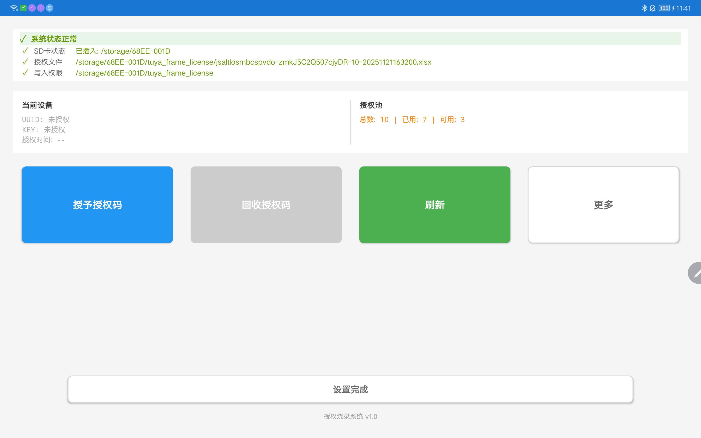
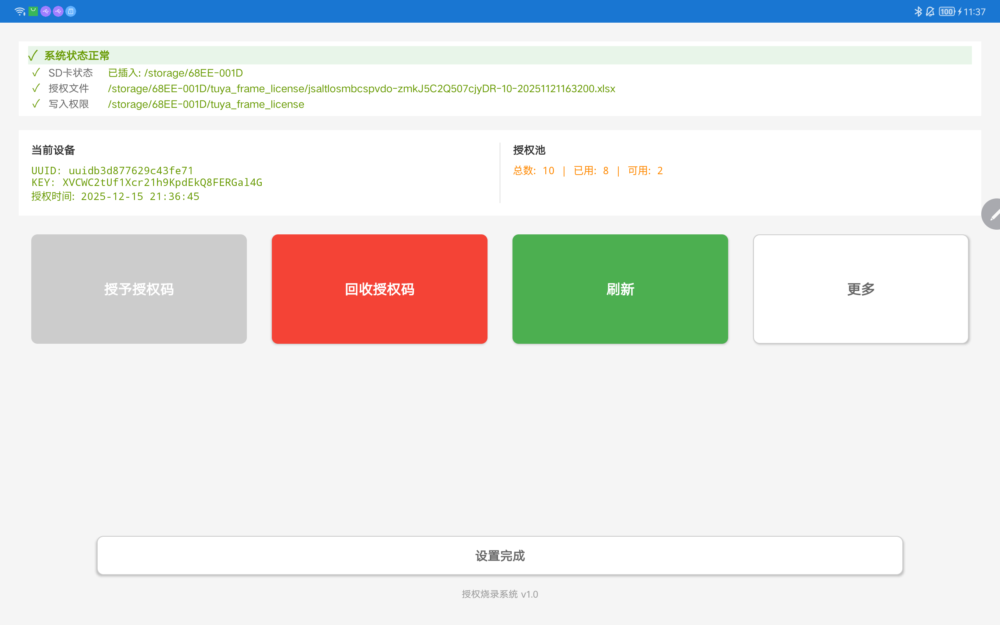
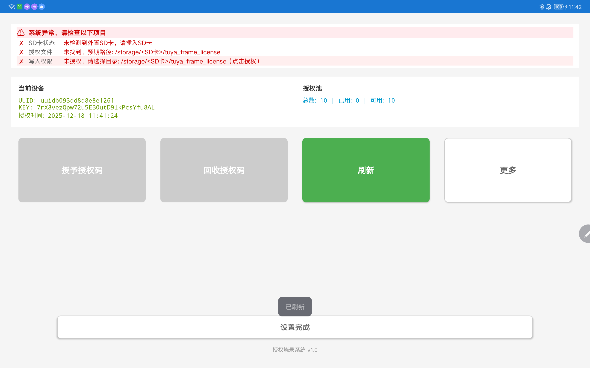
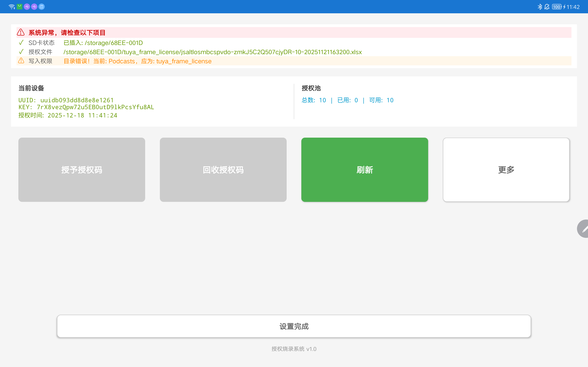

# 产测授权系统使用指南

> 📖 **本文档面向产测操作人员**，介绍如何使用产测授权系统进行设备授权操作。

---


## 🎯 系统介绍

产测授权系统用于在生产测试环节为设备分配授权码，支持授权码的授予、回收和状态查看。

### 主要功能

- ✅ **授权码授予** - 为设备分配授权码
- ✅ **授权码回收** - 回收已分配的授权码，返回授权池
- ✅ **状态检查** - 实时检查系统状态（SD卡、授权文件、权限）
- ✅ **信息查看** - 查看当前设备授权信息和授权池统计

---

## 📦 准备工作

### 1. 准备 SD 卡（TF卡）

- ✅ 使用**外置 SD 卡**（不是设备内置存储）
- ✅ SD 卡格式化为 FAT32 或 exFAT 格式
- ✅ 确保 SD 卡可以正常读写

### 2. 准备授权文件

#### 2.1 创建授权文件夹

在 SD 卡根目录创建文件夹：`tuya_frame_license`

**路径示例：**
```
/storage/xxxx-xxxx/tuya_frame_license/
```

#### 2.2 放置授权 Excel 文件

将授权 Excel 文件（`.xlsx` 或 `.xls` 格式）放入 `tuya_frame_license` 文件夹中。

**要求：**

- ✅ 文件夹中**有且仅有一个** Excel 文件
- ✅ Excel 文件包含授权码列表（UUID 和 KEY 列）
- ✅ 文件格式正确，可以被正常读取

**文件结构示例：**
```
SD卡根目录/
└── tuya_frame_license/
    └── license.xlsx  (授权码文件)
```

### 3. 插入 SD 卡

将准备好的 SD 卡插入设备的 SD 卡槽中。

---

## 🚀 操作流程

### 步骤1：进入产测页面

从应用主界面进入产测授权页面。

### 步骤2：检查系统状态

打开页面后，顶部会显示**系统状态检查清单**，请确认以下三项都显示为 ✅：


| 检查项 | 正常状态 | 异常处理 |
|--------|----------|----------|
| **SD卡状态** | ✅ 已插入: /storage/xxxx-xxxx | ❌ 未检测到外置SD卡 → 检查SD卡是否插入 |
| **授权文件** | ✅ 显示完整文件路径 | ❌ 未找到 → 检查SD卡中是否有 tuya_frame_license 文件夹和 Excel 文件 |
| **写入权限** | ✅ 显示授权目录路径 | ❌ 未授权 → 点击更多-授权文件目录允许 ，进行授权 |

**⚠️ 重要提示：**

- 如果任何一项显示 ❌ 或 ⚠️，请先解决该问题后再进行授权操作
- 写入权限必须授权到正确的目录：`tuya_frame_license`

### 步骤3：授予授权码



**授权成功后：**
- ✅ 页面会显示授权成功的提示
- ✅ **当前设备**区域会显示设备的 UUID、KEY 和授权时间
- ✅ **授权池**区域会更新统计信息（已使用+1，可使用-1）


### 步骤4：回收授权码（如需要）

如果设备需要回收授权码（例如测试完成后），可以执行回收操作：

1. 点击页面中间的 **【回收授权码】** 按钮（红色大按钮）
2. 系统会弹出确认对话框，提示回收后授权码将返回授权池
3. 点击 **【确定】** 完成回收

**回收成功后：**
- ✅ 授权码返回授权池，可以再次使用
- ✅ **当前设备**区域显示为未授权状态
- ✅ **授权池**区域会更新统计信息（已使用-1，可使用+1）




## ❓ 常见问题

### Q1: 提示"未找到授权文件"或者无 SD卡



**原因：**

- SD 未插入、卡损坏或格式不支持

- SD 卡中没有 `tuya_frame_license` 文件夹
- 文件夹中没有 Excel 文件
- Excel 文件格式错误

**解决方法：**
1. 请查看准备工作中的 准备授权文件步骤。

### Q2: 写入权限错误 



**原因:**

1. 授权的目录非授权码目录

**解决方法：**

1. 更多-选择授权文件权限授予
2. 在目录选择器中，选择 SD 卡上的 `tuya_frame_license` 文件夹
3. 确认选择的目录名称是 `tuya_frame_license`
4. 如果授权了错误目录，重新点击该行进行授权


### Q3: 授权码已用完

**原因：**
- 授权池中的所有授权码都已分配

**解决方法：**
1. 更换包含新授权码的 SD 卡。

### Q4: 授权后设备仍然无法使用

**原因：**

- 设备需要重启或重新初始化

**解决方法：**

1. 重启设备
2. 联系技术支持

---

## 📞 技术支持

如遇到无法解决的问题，请联系技术支持团队，并提供以下信息：

- 系统状态检查清单的截图
- 错误提示信息
- 操作步骤描述
- 设备型号和系统版本

---

**文档版本：** v1.0  
**最后更新：** 2025-12-15
